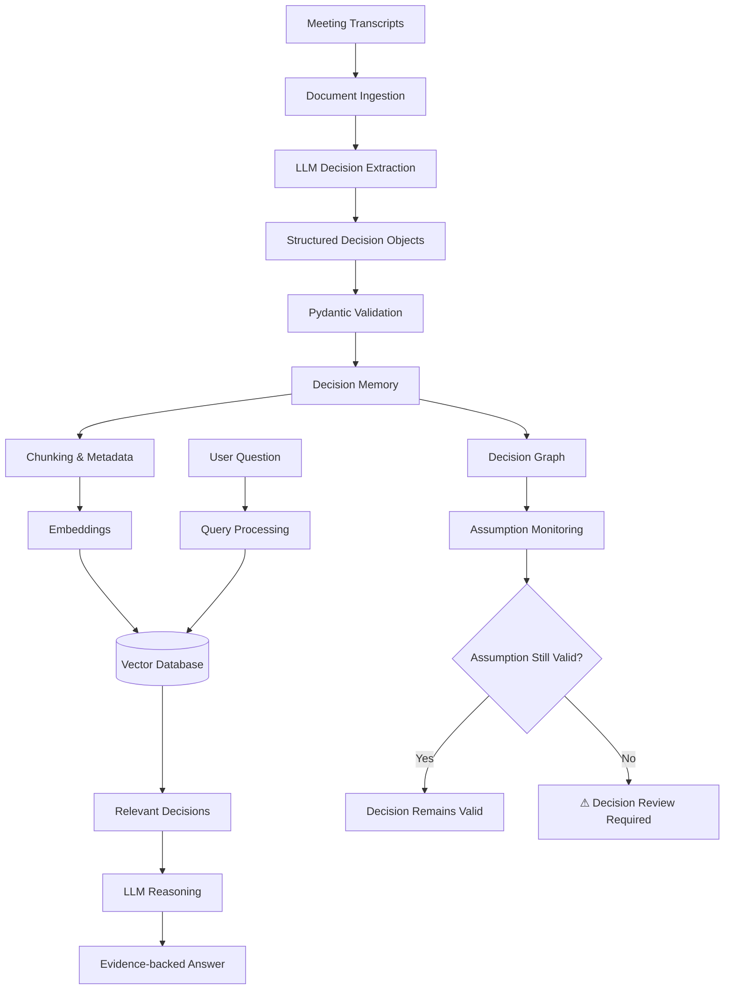
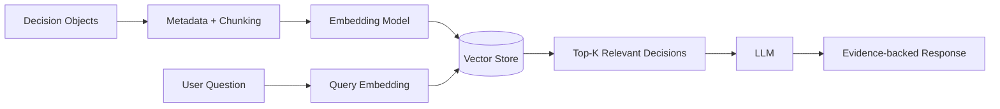
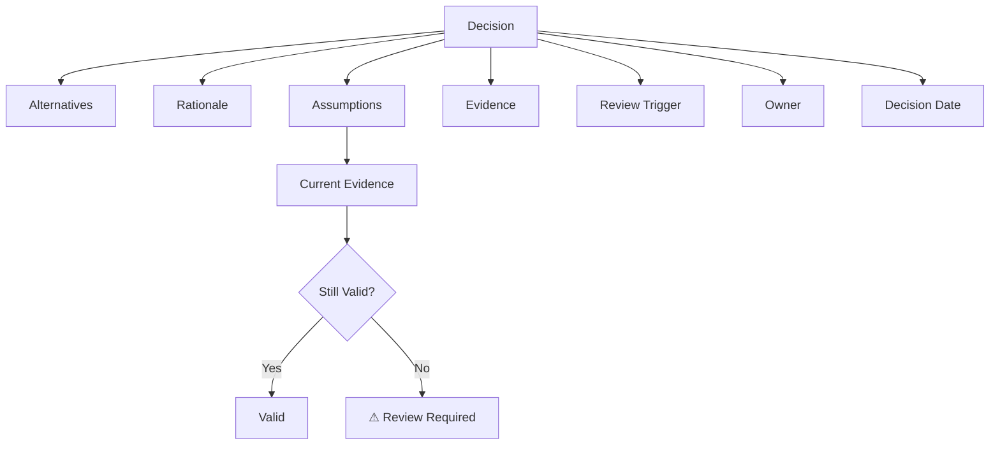

# Decision Trace

### **Never lose the reasoning behind a decision.**

> **DecisionTrace is an LLM-powered decision memory system that converts messy meeting conversations into structured, searchable decisions — including rationale, alternatives, assumptions, evidence, and conditions that should trigger a review.**

---

<p align="center">

**Meeting Transcript → Decision Memory → RAG → Decision Drift Detection**

</p>

---

##  The Problem

Organizations make thousands of decisions every year.

The problem isn't that decisions aren't documented.

The problem is that their **reasoning disappears**.

Six months later, someone asks:

> *"Why did we choose RabbitMQ?"*

> *"Why didn't we use Kafka?"*

> *"Who made that decision?"*

> *"What assumption did we make at the time?"*

> *"Is that assumption still true?"*

The answer is usually buried somewhere inside a meeting transcript, Slack conversation, email thread, Jira ticket, or architecture document.

### This creates **Decision Debt**.

DecisionTrace aims to turn that forgotten reasoning into **machine-readable organizational memory**.

---

#  What DecisionTrace Does

DecisionTrace takes unstructured conversations and extracts:

```text
                    MEETING
                       │
                       ▼
              ┌─────────────────┐
              │  LLM Extraction  │
              └────────┬────────┘
                       │
                       ▼
               DECISION MEMORY
                       │
        ┌──────────────┼──────────────┐
        ▼              ▼              ▼
     Decision       Rationale     Alternatives
        │
        ├──────────► Assumptions
        │
        ├──────────► Evidence
        │
        └──────────► Review Triggers
```

Instead of storing only:

> **"Use RabbitMQ."**

DecisionTrace stores:

> **Decision:** Use RabbitMQ
> **Alternative:** Kafka
> **Reason:** Current workload is ~2K events/sec
> **Assumption:** Traffic remains below 10K events/sec
> **Review trigger:** Reconsider when traffic exceeds 10K events/sec

---

#  The Interesting Part: Decision Drift

Most RAG systems answer questions about **what happened in the past**.

DecisionTrace goes one step further.

It asks:

> **"Does the reasoning behind an old decision still hold today?"**

### Example

An engineering team decides:

```text
Use RabbitMQ

Because:
Current traffic < 10K events/sec

Review when:
Traffic > 10K events/sec
```

Six months later:

```text
Current traffic = 13.5K events/sec
```

DecisionTrace can identify:

```text
             HISTORICAL DECISION
                     │
                     ▼
             RabbitMQ selected
                     │
                     ▼
          Assumption: < 10K/sec
                     │
                     │
                  TIME
                     │
                     ▼
             Current: 13.5K/sec
                     │
                     ▼
             ⚠ ASSUMPTION BROKEN
                     │
                     ▼
             REVIEW DECISION
```

The goal isn't to automatically change the decision.

The goal is to tell the team:

> **⚠ This decision may need to be revisited because one of its original assumptions is no longer true.**

---

#  Architecture



---

#  Core Workflow

## 1. Ingest

DecisionTrace starts with unstructured information:

```text
Meeting transcript
        ↓
Email
        ↓
Design discussion
        ↓
Architecture document
        ↓
Jira discussion
```

The initial MVP focuses on **meeting transcripts**.

---

## 2. Understand

The LLM analyzes the conversation and identifies decision-related information.

```text
"What should we use?"

       ↓

Decision
Alternatives
Rationale
Assumptions
Review Triggers
Evidence
```

---

## 3. Structure

The LLM output is validated using Pydantic.

```python
Decision(
    decision="Use RabbitMQ",
    alternatives=["Kafka"],
    rationale=[
        "Current workload is approximately 2K events/sec"
    ],
    assumptions=[
        "Traffic remains below 10K events/sec"
    ],
    review_triggers=[
        "Traffic exceeds 10K events/sec"
    ]
)
```

This creates a deterministic application layer around probabilistic LLM output.

---

# 4. RAG Pipeline

Once decisions are extracted, they become searchable organizational memory.



Example:

### User

> Why did we choose RabbitMQ?

### Retrieval

```text
Decision #17
Alternative: Kafka
Rationale: Current traffic ~2K/sec
Assumption: Traffic <10K/sec
Review trigger: Traffic >10K/sec
```

### Response

> RabbitMQ was selected because the expected workload was approximately 2K events/sec. Kafka was considered but its scalability advantages were not considered necessary at the time. The original decision should be reviewed if traffic exceeds 10K events/sec.

---

#  Decision Memory Model

Each decision is represented as a structured object:



This structure allows us to move beyond simple document retrieval toward **decision reasoning**.

---

#  Technology Stack

| Layer           | Technology                             |
| --------------- | -------------------------------------- |
| Language        | Python                                 |
| LLM             | Llama 3.2 via Ollama                   |
| LLM Interface   | Ollama Python API                      |
| Validation      | Pydantic                               |
| Embeddings      | Sentence Transformers                  |
| Vector Search   | FAISS                                  |
| API             | FastAPI                                |
| UI              | Streamlit                              |
| Graph           | NetworkX                               |
| Testing         | Pytest                                 |
| Version Control | Git / GitHub                           |
| CI/CD           | GitHub Actions                         |
| Deployment      | Free-tier / open-source infrastructure |

> The project is intentionally being developed from the fundamentals first, before introducing orchestration frameworks such as LangChain or LangGraph.

---

#  Project Structure

```text
decisiontrace/
│
├── app/
│   ├── api/
│   │
│   ├── extraction/
│   │   └── decision_extractor.py
│   │
│   ├── llm/
│   │   └── client.py
│   │
│   ├── models/
│   │   └── decision.py
│   │
│   └── rag/
│
├── data/
│   ├── raw/
│   └── processed/
│
├── tests/
│
├── requirements.txt
├── README.md
└── .gitignore
```

---

#  Current Development Status

### Phase 1 — Foundation

* [x] Git repository
* [x] Python virtual environment
* [x] Local LLM with Ollama
* [x] LLM client
* [x] Pydantic decision schema
* [x] Initial decision extraction
* [x] GitHub repository

### Phase 2 — Structured Decision Memory

* [ ] Multiple decisions per meeting
* [ ] Evidence/source references
* [ ] Decision IDs
* [ ] Metadata
* [ ] Persistent storage

### Phase 3 — RAG

* [ ] Document chunking
* [ ] Embeddings
* [ ] Vector database
* [ ] Semantic retrieval
* [ ] Reranking
* [ ] Evidence-grounded answers

### Phase 4 — Decision Intelligence

* [ ] Decision graph
* [ ] Assumption extraction
* [ ] Review triggers
* [ ] Temporal reasoning
* [ ] Decision drift detection

### Phase 5 — Production

* [ ] FastAPI
* [ ] Streamlit UI
* [ ] Evaluation framework
* [ ] Automated tests
* [ ] GitHub Actions
* [ ] Docker
* [ ] Free deployment

---

#  Example

### Input

```text
Alice:
We need to choose Kafka or RabbitMQ.

Bob:
I recommend RabbitMQ because our current workload
is around 2,000 events per second.

Carol:
What happens if traffic increases?

Bob:
If we cross 10,000 events per second, we should
reconsider Kafka.

Alice:
Agreed. Let's use RabbitMQ for now.
```

### DecisionTrace

```json
{
  "decision": "Use RabbitMQ",
  "alternatives": [
    "Kafka"
  ],
  "rationale": [
    "Current workload is approximately 2,000 events per second"
  ],
  "assumptions": [
    "Traffic remains below 10,000 events per second"
  ],
  "review_triggers": [
    "Traffic exceeds 10,000 events per second"
  ]
}
```

---

#  Future Vision

DecisionTrace could eventually ingest:

```text
Slack
Teams
Email
Jira
GitHub Issues
Meeting Transcripts
Architecture Documents
Product Documents
```

and build a continuously evolving:

```text
             ORGANIZATIONAL
               DECISION
                MEMORY
                   │
       ┌───────────┼───────────┐
       ▼           ▼           ▼
    Decisions   Assumptions   Evidence
       │           │           │
       └───────────┼───────────┘
                   ▼
             Current State
                   │
                   ▼
            Decision Drift
                   │
             ┌─────┴─────┐
             ▼           ▼
           Valid       Review
```

The long-term vision is an AI system that doesn't merely answer:

> **"What did we decide?"**

but also:

> **"Why did we decide it?"**

> **"What assumptions did we make?"**

> **"What evidence supported it?"**

> **"What has changed since then?"**

> **"Should we reconsider the decision?"**

---

#  Why This Project?

DecisionTrace explores an important question in enterprise AI:

> **Can an LLM preserve organizational reasoning instead of simply retrieving organizational information?**

The project is intentionally built incrementally to investigate that question.

---

#  Evaluation Goals

The system will eventually be evaluated on:

| Metric                       | What it measures                                    |
| ---------------------------- | --------------------------------------------------- |
| Decision Extraction Accuracy | Did we identify the correct decision?               |
| Retrieval Recall@K           | Did we retrieve the relevant decision?              |
| Evidence Accuracy            | Does the evidence actually support the answer?      |
| Faithfulness                 | Did the LLM stay grounded in retrieved information? |
| Hallucination Rate           | How often does the system invent information?       |
| Citation Accuracy            | Are sources correctly attributed?                   |
| Latency                      | How quickly does the system respond?                |

---

#  Development Philosophy

DecisionTrace is intentionally **not starting with an AI framework abstraction**.

The initial pipeline is built from first principles:

```text
Python
  ↓
LLM
  ↓
Structured Output
  ↓
Validation
  ↓
Retrieval
  ↓
Reasoning
```

Frameworks can be introduced later when they solve a demonstrated engineering problem.

This makes the project easier to understand, test, optimize and defend technically.

---

#  Roadmap

```text
                 DecisionTrace
                       │
          ┌────────────┴────────────┐
          │                         │
       TODAY                     FUTURE
          │                         │
          ▼                         ▼
  LLM Decision Extraction     Decision Graph
          │                         │
          ▼                         ▼
  Structured Memory          Assumption Tracking
          │                         │
          ▼                         ▼
        RAG                    Drift Detection
          │                         │
          └────────────┬────────────┘
                       ▼
               Decision Intelligence
```

---

##  Project Status

Early development

The project is being built incrementally with a focus on understanding the underlying LLM/RAG architecture rather than hiding complexity behind frameworks.

---

##  License

MIT License
